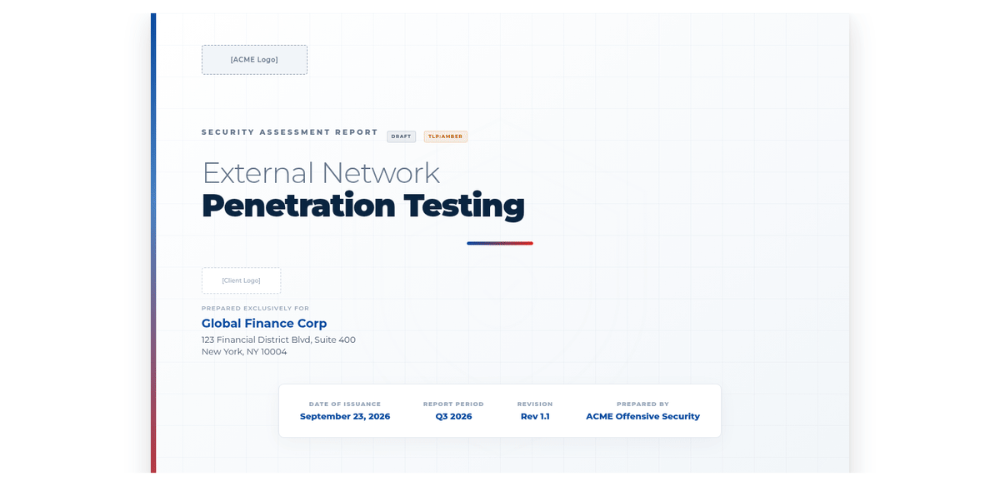
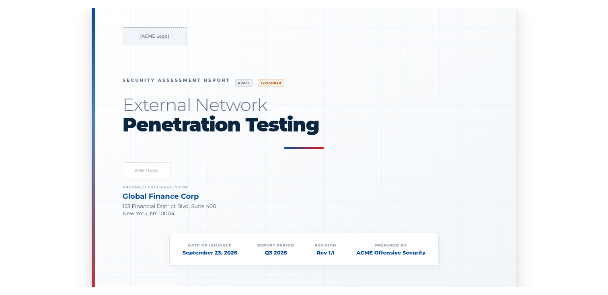
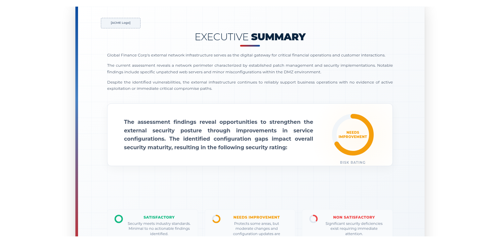
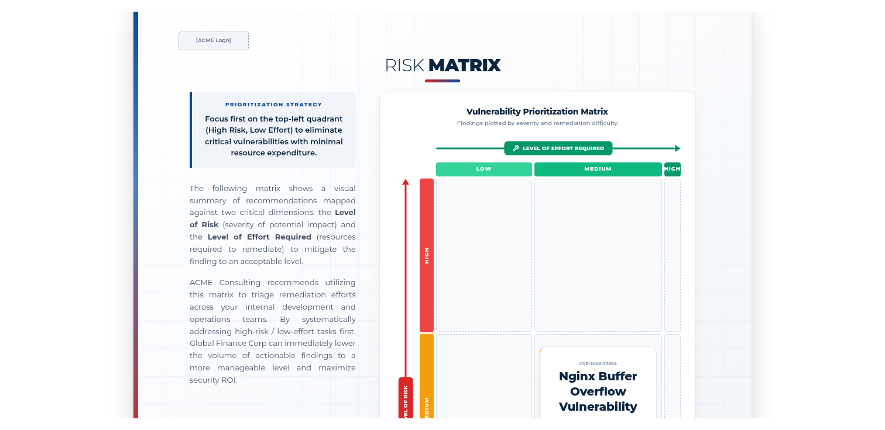
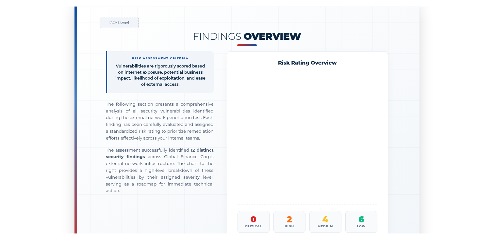
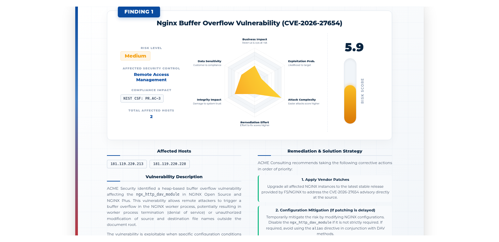
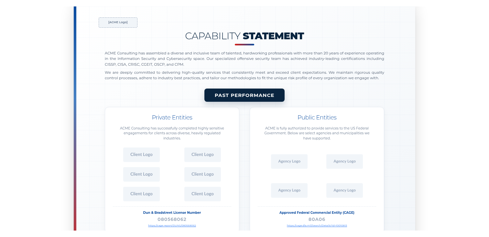

# Beautiful HTML Penetration Testing Report Template

Beautiful, interactive HTML penetrations and professional report templates that prints to a perfect pixel PDF.

This project provides a highly professional, easily modifiable deliverable format designed for cybersecurity consultancies, internal red teams, and enterprise security professionals. It replaces rigid legacy document formats with a modern, web-native approach that seamlessly exports to a flawless 11x8.5 landscape PDF.

## Visual Demonstration

---

## Key Enterprise Features

- **Executive-Ready Presentation:** Designed to communicate complex security findings effectively to both technical stakeholders and executive leadership.
- **Pixel-Perfect Export:** Engineered with rigorous `@media print` CSS directives ensuring a 1:1 translation from the browser to a perfectly paginated, landscape PDF without margin degradation or layout breaks.
- **Comprehensive Template Suite:** Includes 13 pre-formatted layouts covering Executive Summaries, Risk Matrices, Detailed Findings, Proof of Concepts, and Capability Statements.
- **Interactive Data Visualization:** Integrates industry-standard charting libraries (Chart.js / Highcharts) for dynamic presentation of metrics and maturity models.
- **Zero-Friction Deployment:** Pure HTML and CSS architecture. Requires no complex build pipelines or proprietary software to edit and deploy.

---

## Usage Instructions

1. **Clone the Repository:** Download the project files to your local environment.
2. **Edit the Content:** Open `combined_report.html` in your preferred code or text editor to populate your specific assessment data, client branding, and vulnerability metrics.
3. **Preview:** Open the file in a modern web browser to review the interactive layout.
4. **Generate PDF:** Use the browser's native print function (Ctrl+P / Cmd+P) and save as PDF. The document will automatically format into a 13-page, landscape executive report.

---

## Template Gallery

A selection of included page layouts:

| Cover Page | Executive Summary | Risk Matrix |
|:---:|:---:|:---:|
|  |  |  |

| Findings Overview | Technical Details | Capability Statement |
|:---:|:---:|:---:|
|  |  |  |

---

## Contributing

We welcome contributions from the cybersecurity community. Please submit pull requests or open issues to propose new layouts, design refinements, or reporting features.
